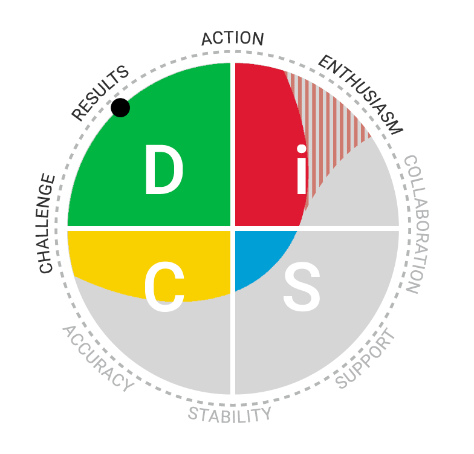

## DiSC® assessment

According to a DiSC® assessment\*, Eva falls into the **Dominance** category with a bit of **Influence** dazzled in her personality.

People with the D style tend to be **direct**, **driven**, and **strong-willed**. They grow restless easily and instead of celebrating move on to the next goal. They **question the rules** and **speak up** when they notice any problems. Their directness may occasionally come across as too harsh or even aggressive. They are **easy to read**, especially when they are irritated. People with the D style **enjoy challenging assumptions, being in charge and making things happen**.

Unlike others with the D style, Eva prioritises **maintaining a positive, upbeat attitude**. She **focuses on the advantages** of a situation and can come across as somewhat lighthearted even when stressed. Her uplifting **cheerfulness** and **positive energy** are influential to those around her.

\*Taken in December 2020

## CliftonStrengths test

Based on the [CliftonStrengths](https://www.gallup.com/cliftonstrengths/en/home.aspx) test\*\*, Eva is a terrific **conversationalist** and **presenter**. She can turn telling about a seemingly mundane event into a fascinating hour-long show with theatrics and drama. When she talks, she **paints a picture with her words** to ensure that you remember her story. The downside is that she can easily go on for hours and use up her daily word limit on telling you about her breakfast.

She finds pleasure in **starting conversations with strangers**. She is rarely at a loss of words and winning over new people is a challenge for her. However, once the connection is made, she moves on to new people.

Eva is passionate about **learning**. The content is less important to her than the journey from complete ignorance to mind-boggling competence. She thrives in **dynamic work environments** where she is expected to learn a lot about a subject matter in a short period of time and then move on to the next project.

Eva **collects** things, be it information, thoughts, or tangible objects. She files them away for possible future synthesis. She finds almost everything interesting, so she owns a vast library of items and experiences. Thanks to that, she is easily capable of **finding connections between seemingly disparate phenomena**. She enjoys taking the world we all know and turning it around so it can be seen from a strange but enlightening angle.

\*\*Taken in October 2020
