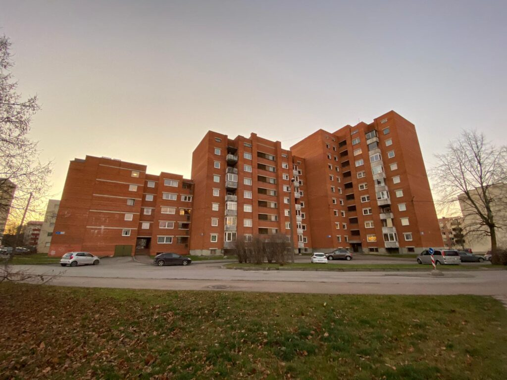
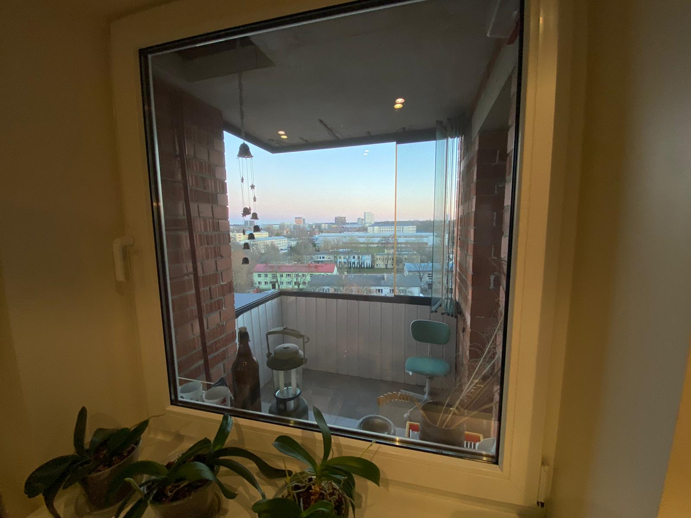
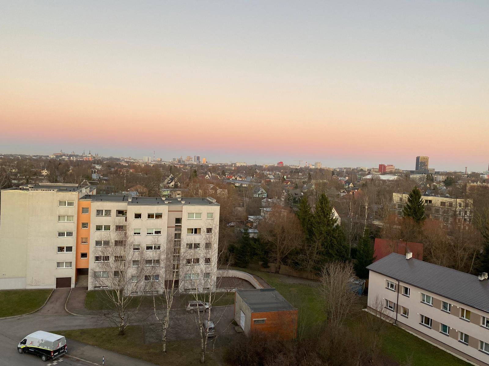
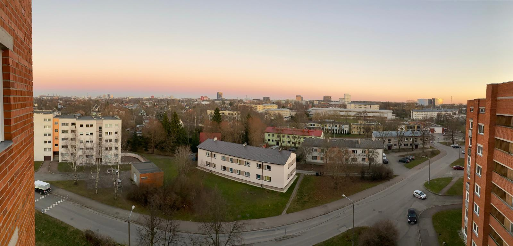
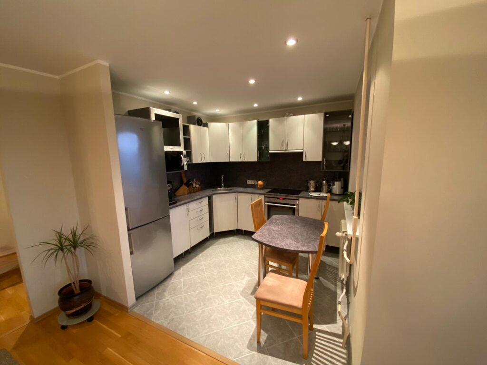
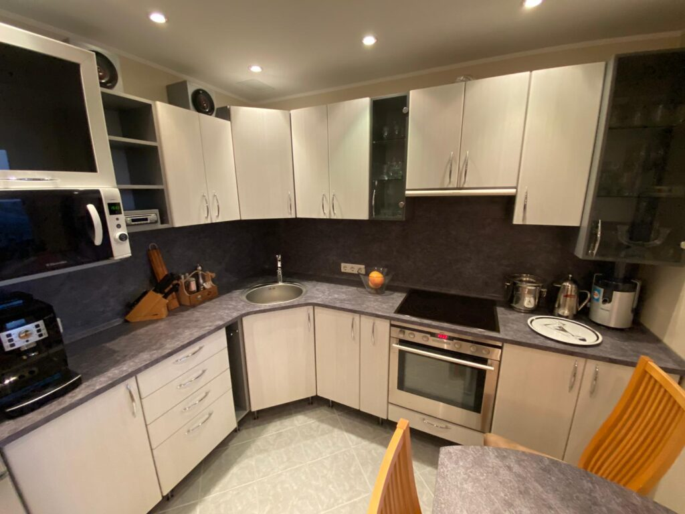
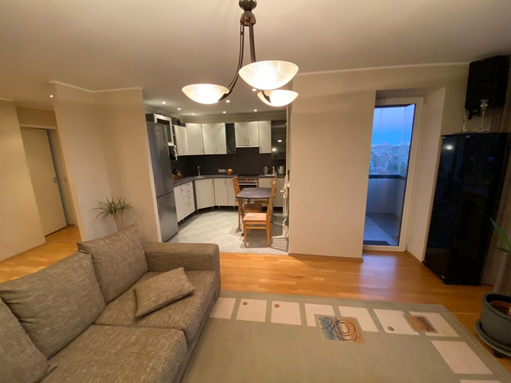
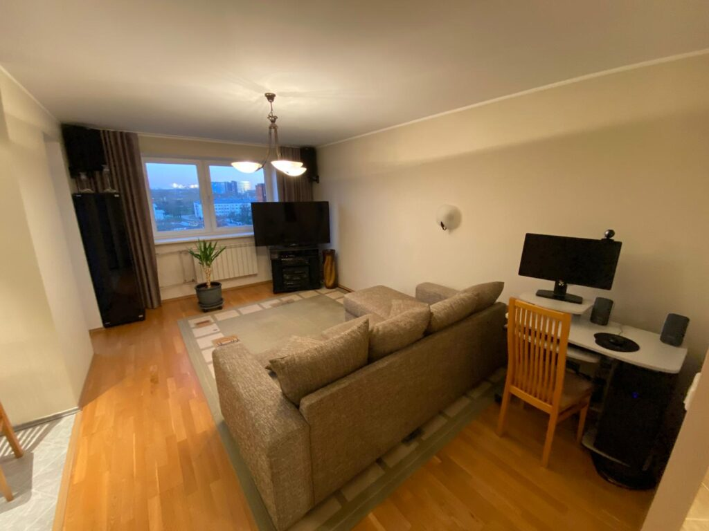
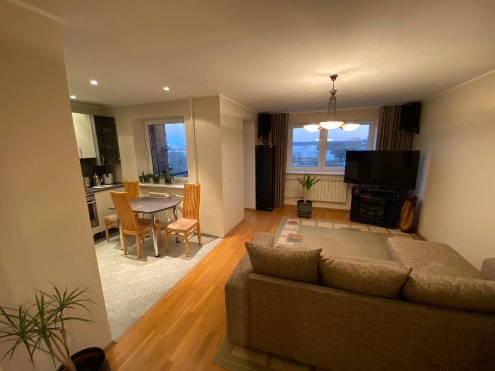

Yup. Just nii. Mul on nüüd päris oma kodu. Ise kogusin raha, ise tegin sissemakse, ise võtsin laenu, ise allkirjastasin lepingu, ise võtsin müüjalt vastu võtmed ja lõin jalaga oma uue korteri ukse lahti.

Ausalt, ma ei oleks osanud paremat korterit tahtagi. See on lihtsalt suurepärane. Siin on u 10 aastat tagasi tehtud põhjalik remont, mille käigus heliisoleeriti põrandad ja laed, tõmmati seinad sirgeks ning ehitati välja hiiglaslik vannituba.

Minu päris oma korter asub Tallinnas, Kristiine ja Mustamäe linnaosade piiril Siili tänaval. Minu päris oma kodu aadressiks on Siili 21/3-95, 13422, Tallinn, Eesti. See on neljatoaline korter üheksakorruselise maja eelviimasel ehk kaheksandal korrusel. Maja ise on küll soojustamata, aga ka see on meie korteriühistul tulevikus plaanis. See ei ole paneelmaja, vaid kivimaja. Seega on ka heliläbilaskvus ja soojusliikuvus väiksem. Ideaalne. Parkimine maja ümbruses on tasuta, nii et kõik võivad mulle oma autodega külla tulla! Kuigi ühistranspordipeatused on ka igas ilmakaares väga lähedal.

Minu korter on 74,7 ruutmeetrit, millest 2 ruutmeetrit võtab enda alla raamideta klaasitud rõdu. Rõdult ja korteri akendest avanevad imelised vaated. Kui ärkan, piilun üle linna Mustamäe poole. Kui hommikul hambaid pesen, vaatan vastvalminud Järve torne. Kui rõdul hommikukohvi joon, paistavad taamal vanalinna kirikutornid. Uskumatult kaunid vaated. Aknad võiksid küll natuke suuremad olla, et rohkem valgust ja vaadet sisse pääseks, aga ka nii on hea. Ükski korter ei vaata ega hakka ka tulevikus mulle aknast sisse vaatama. Kardinaid ma sisuliselt ei kasutagi. Isegi, kui alasti ringi käin.

<figure>

- 
    
- 
    
- 
    
- 
    

<figcaption>

Vaated minu korterist

</figcaption>

</figure>

Köögi sain ma juba sisustatult ja koos suure külmkapiga. Ma pole kunagi eriline kokkaja olnud, aga selle pliidi ja ahjuga on kokkamine lausa nauding. Ma hakkasin viimaks ometi küpsetama! Ema võib mu üle uhke olla. Pliidi kohal on tõmbekapp ja tolle ventilatsiooni jagan ma vaid ülemise korruse korteriga. Kui midagi kõrbema läheb, kannatavad ainult nemad. Ups!

Köök on avatud otse elutuppa, nii et ma saan samal ajal telerit vaadata ja süüa teha. Mulle meeldib, et kööginurk on piisavalt suur, aga mitte ülemäära. Uskumatu, aga ma pole veel kõiki kappe-sahtleid suutnud isegi täis saada. Mul pole vist kunagi köögis nii palju ruumi olnud. Eelmised omanikud jätsid kööki ka tööpinnaga ühte karva laua ja sisse ehitatud helisüsteemi koos kõlaritega. Ma kokkan sageli muusika saatel. Ja mõnikord kuulan raadiost ka uudiseid. See meenutab mulle ema ülikooliaegset kööki, kus kõrvaltoa noormehed samuti kõlarid kööki viisid.

Ostsin endale mikrolaineahju, mis mahub täpselt ühte riiulivahesse. Nii ei võta ta ka asjatult köögipinda ära. Mulle meeldib, et köögimööbel on maapinnast kõrgemal ja seisab jalgade peal. See võimaldab mu robottolmuimejal lihtsasti ka köögikappide alt põrandat puhastada. Ah jaa, mul on nüüd robottolmuimeja ka. Lisaks tolmu imemisele see ka peseb põrandaid. Ülimugav!

Köögipõrand on plaaditud ja soojendusega, kuid see on enamasti välja lülitatud, sest ma kannan niikuinii kodus susse. Aga on hea teada, et vajadusel saan seal varbaid soojendada. Eriti meeldib mulle kohtvalgustus kraanikausi ümbruses. See on täpselt selline tasane ja romantiline, et kui ei taha lõõskava valguse all kokata, piisab ka sellest. Ma kasutan seda tavaliselt hommikuti. Ma panin enamuse oma vaestest sukulentidest köögi aknalauale. See on lai ja siin saavad nad valgust.

Üks asi, mis mulle mu köögi juures ei meeldi, on see, et kapid on pealt tühjad. Sinna koguneb tolm ja rasu ja pean tööpinna peale ronima, et neid sealt puhastada. Teine asi on kraanikausi kõrval olev välja tõmmatav rätikuhoidja. Tilgutan terve põranda täis, enne kui rätikule ligi saan. Sellepärast hoiangi rätikut enamasti kas ahjuukse küljes või mõne kapiukse lingil. Aga muidu on köök suurepärane.

Elutoas on samuti sisseehitatud kõlarid. Sisse ehitatud selles mõttes, et juhtmed jooksevad ripplae all. Ostsime need eelmistelt omanikelt koos helisüsteemida ära. Töötavad väga mõnusasti. Elutuba on selline parajalt suur, et mahub ära, aga samas on hubane olla. Ma alles katsetan paigutusega, sest ei tahaks teleriga akent ära varjata, aga parimad pistikupesad on just akna all. Põrandale ostsin suure vaiba, sest siis on mõnusam astuda.

- 
    
- 
    
- 
