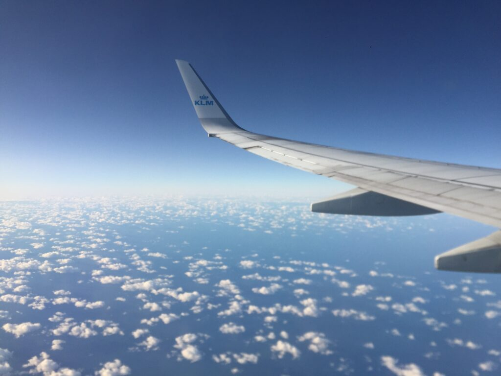
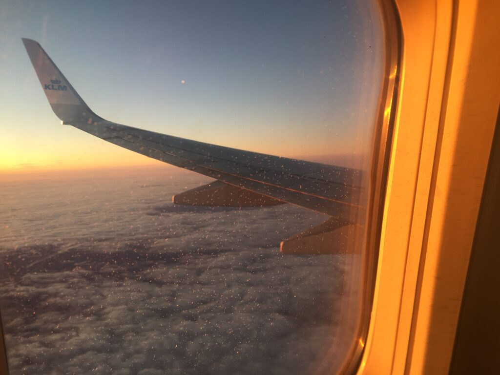
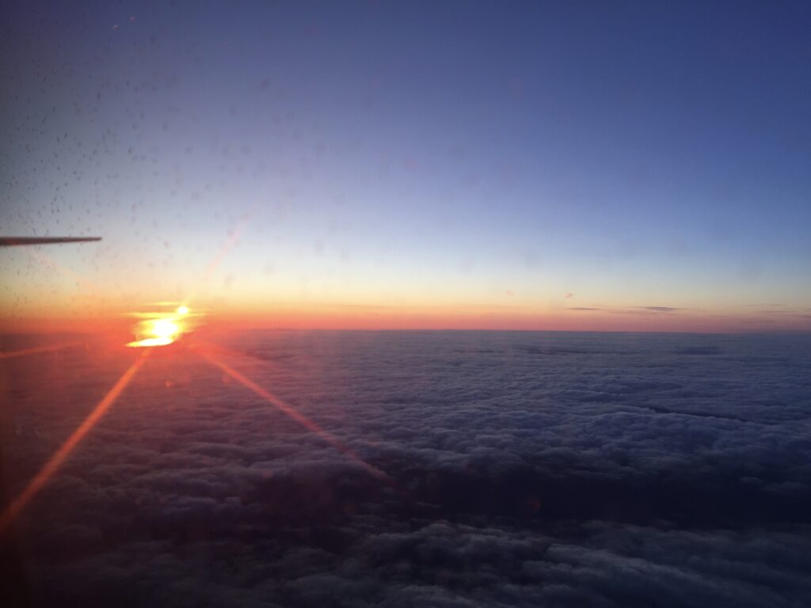
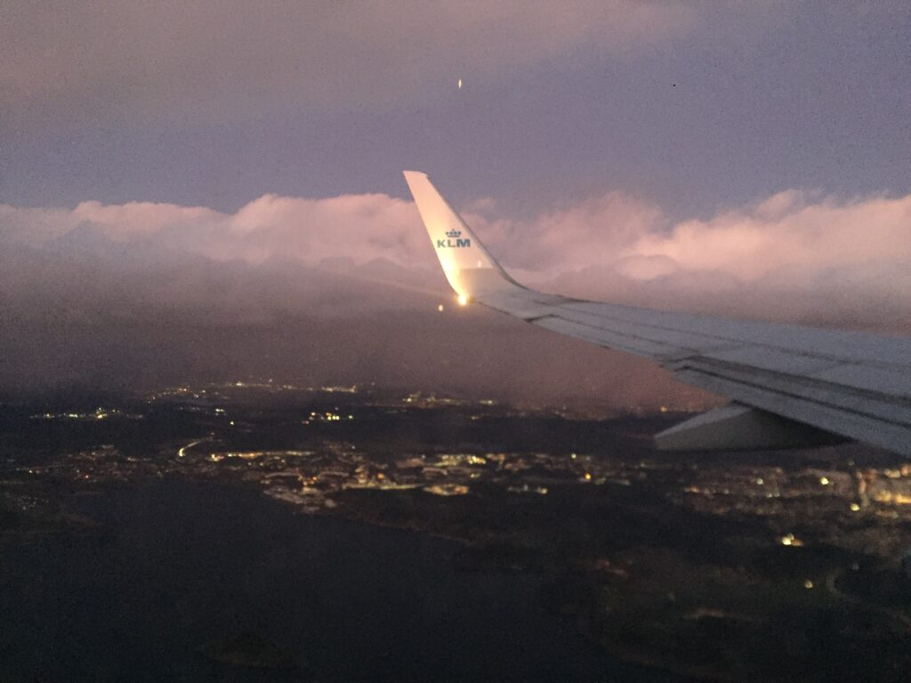
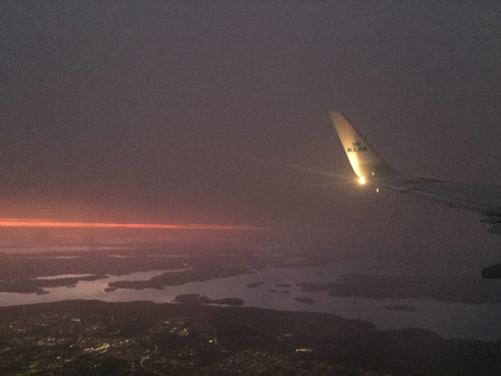
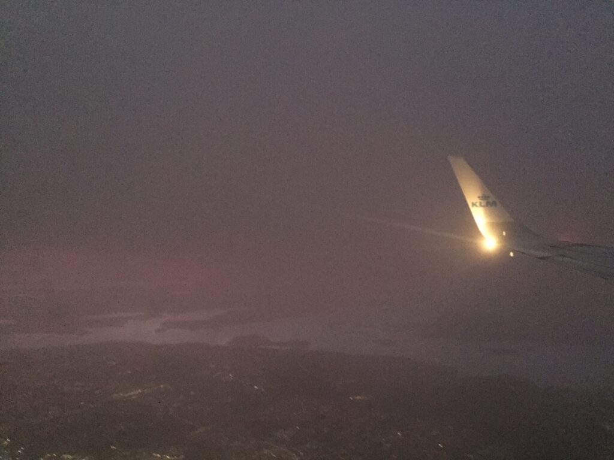

A metal bird makes one last turn  
as the final rays of a setting star  
glance over its wings  
disappearing into the soft milkiness  
as light as a lovers’ first kiss  
leaving behind a glowing belt of pink.

The night has arrived.  
And so have I.

<!--more-->

- 
    
- 
    
- 
    
- 
    
- 
    
- 
