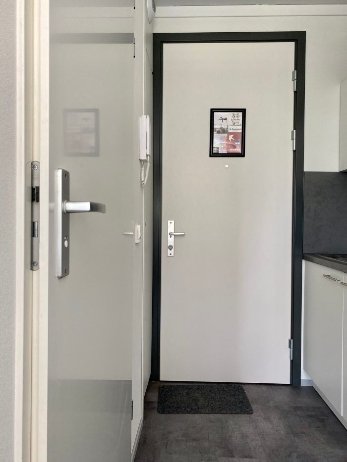
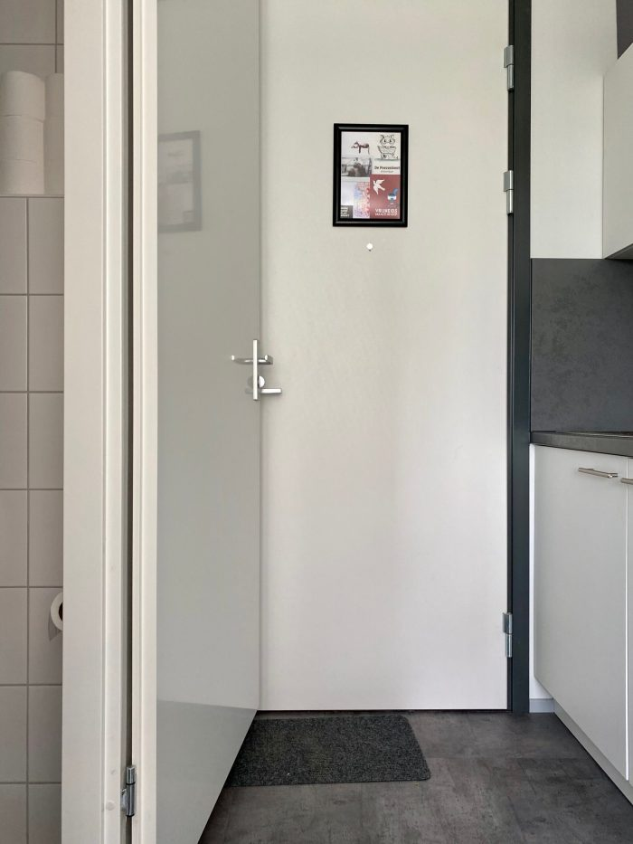

It was a splendid morning in the Netherlands. The weather was nice. The sun was shining.

Around 8 a.m., Eva was stretching her sleepy limbs. She heard people unlocking their bikes, seagulls fighting over garbage, and trains riding off to who-knows-where. A gentle wind squeezing in through the half-open window was caressing her forehead.

She had planned to be extremely productive that day. First, she would wrap up the opposition report. Then she would take out the garbage, have breakfast, and work on her thesis. Maybe even send out a couple of job applications?

Little did she know what this day had in store for her.

<!--more-->

The start of the day was promising. Eva rolled out of the bed, finished the last sections of the report and handed it in.

She decided to reward herself with some breakfast. How about a bowl of fruit, muesli and yoghurt with some seeds sprinkled on top? Yum!

But the garbage bag was nearly overflowing and would not have fit another core of an apple. This needed to be dealt with first.

Eva squashed the garbage bag and tied a nice knot on top. She grabbed her keys - without them she could not get back inside -, pushed the wide-open bathroom door out of her way, and cheerfully ran down the stairs, letting the front door fall shut behind her.

She returned in a blink of an eye, unlocked the front door, pushed it and...

It didn't open.

Well, to be honest, it did, but it only moved for about two centimetres or less, creating a 3-millimetre gap between the door and the doorframe.

<figure>

<figcaption>

_The front and bathroom doors both open towards the narrow kitchen-corridor_

</figcaption>

</figure>

Eva immediately realised her mistake.

She was not locked out. She was **blocked** out.

Eva's home is a tiny studio with a narrow kitchen-corridor opposing the bathroom. The opening paths of the front door, the bathroom door, and a couple of cupboards overlap. This means that Eva is constantly playing a game of close-a-door-to-open-another-one.

The bathroom door also tends to either fall completely shut or fully open depending on the angle it is left at. When Eva pushed the bathroom door aside to take out the garbage, she did not ensure that it actually exceeded the critical angle and fell shut.

Quite the opposite. The bathroom door decided to spread itself across the corridor and block the front door as a result. Perhaps the draught was also at fault.

Rule number one of finding yourself unable to enter your home - don't panic.

Rule number two - think outside the box.

Rule number three - brush up on your burglar skills.

<figure>

<figcaption>

_A wide-open bathroom door successfully blocks the front door from opening_

</figcaption>

</figure>

"Perhaps I could climb in through the window?", Eva thought to herself.

Even if she had managed to climb to the second (third?) floor without breaking any of her limbs, that would have been of no use because the tilt-and-turn window was on the ventilation setting, leaving only a narrow gap at the top.

"What if I used a thin object to shove it through the gap between the door and the frame and use that to push the bathroom door away from the front door?"

That was a much better idea, but where would she find a suitable object. Perhaps a knife?

Eva knocked on her neighbour's door and borrowed a knife but it was too thick and rigid to be of any use.

She did a lap around the building and found a piece of wire. Perhaps this would work?

Eva shoved the wire through the narrow gap. She bent it and twisted it and turned it and pulled it and ended up admitting that she is not good enough at burgling to be able to break into her own apartment, even when she has the key.

Being all out of ideas, Eva finally went to the caretaker of her apartment complex. The caretaker came and had a look and shrugged his shoulders. There wasn't much that he could do either. This was no news to Eva because if she had not managed to do it then the only thing that would have helped would have been a team of professionals, either burglars or door people.

The caretaker planted Eva at the local café and treated her to a cup of coffee, asking her to wait. It's not like she had anything better to do, given that everything she owned was in her room. This must have been around 11 o'clock.

So Eva sat in that café, drank some iced coffee, kicked her heels, talked to the staff, twiddled her thumbs, and observed the visitors.

An hour passed and the caretaker returned, telling that a specialist would come from Eindhoven (which is about 1.5 to 2 hours away from Amsterdam) to help. He would arrive at 2 o'clock in the afternoon.

It was not like Eva had any other choice than to wait. Thank God she had not left the stove turned on!

After hearing about the situation, one of the staff members said how the same thing had happened to him. He solved the situation by repeatedly kicking the front door until the bathroom door moved away. He may or may not have broken the door in the process.

"It's certainly worth a try," Eva thought. She took the last sip of her drink, thanked the waiting staff, and shuffled to her apartment.

Bang. Bang. Bang!

Eva felt bad for the door.

Bang. Bang. Bang!

Oop! Was the front door moving? The gap seemed to be getting bigger!

Bang! Bang! Bang!

Yeah, it's definitely working!

Bang! Bang! BANG!

The bathroom door moved aside and the front door flew open. After almost three hours, Eva finally had access to her apartment again!

The first thing she did was run to the telephone and call the caretaker. The specialist from Eindhoven could turn around and go back home as he was not needed anymore.

The second thing she did was assess the damage.

It was not that bad. There was a slight dent in the bathroom door at where the door handle of the front door had hit it. It was barely noticeable.

The doorframe of the bathroom door was a different topic. The lower part of the frame had been pushed away from the wall it had been attached to. It had shifted by a centimetre - away from the wall and inwards to the bathroom. Nothing that a hammer could not fix!

Eva took off the bathroom door that was already hanging on two of the three hinges and set it aside.

She grabbed the box full of Estonian chocolate and sweets her mother had sent her, stuffed a bag full of chocolate bars, and ran back to the café. Each of the staff members got a bar as a thank you gift for entertaining Eva. The caretaker also got one for all his troubles.

Eva borrowed a hammer from the café, ran back to her apartment, and hammered the door frame back to its rightful place.

Unfortunately, the door itself was too heavy for her to put it back on the hinges on her own. "How did I even manage to take it off?!", she pondered as she asked for help in a group chat.

Two strong and clever guys (rewarded with Estonian sweets) later, Eva's studio looked as usual, apart from a small pile of plaster dust near the bathroom door.

"All is well that ends well," Eva thought to herself. "I am sure I will make the same mistake again in the future one way or another, but at least now I know that violence is the answer."
