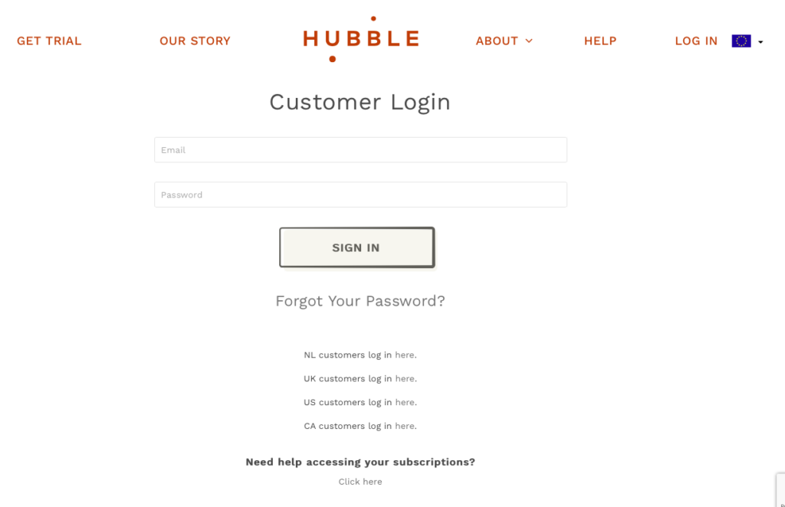
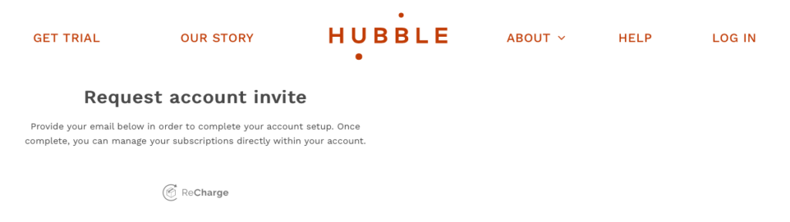
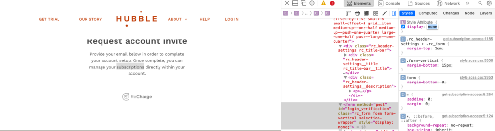
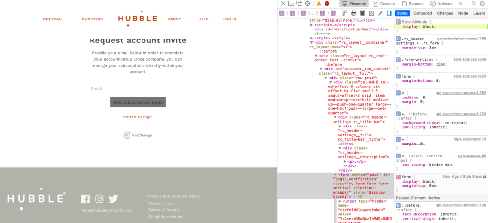
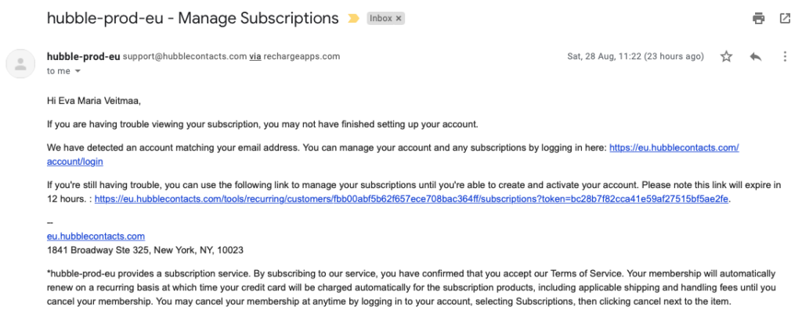
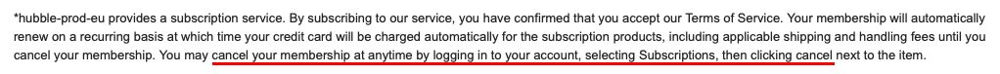
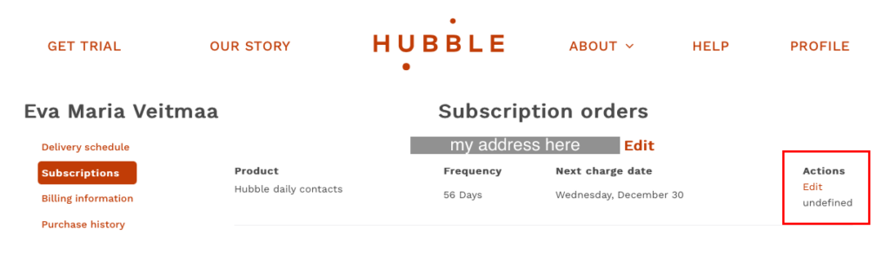

99% of the time, [I am a glasses person](https://evamaria.info/dare-to-adopt-a-new-perspective/ "Dare to adopt a new perspective"). However, contact lenses are safer and more comfortable when wearing a motorcycle helmet. Since I am all about saving, I have been exploring various options of getting lenses for cheap. Fortunately, lots of places offer trials for only a couple of bucks.

<!--more-->

There is a catch, though. While signing up for a trial subscription is easy, making sure you do not get charged immense amounts afterwards can be tricky. The following is a true experience I had when trying to cancel a subscription of [Hubble lenses](https://eu.hubblecontacts.com). The funny thing is, I might have considered extending my subscription if it had not been for the following.

#### **Logging into my account was nearly impossible**

When I went to log into my account, I could not do so. I had no emails from Hubble regarding login details, just order confirmation. I went to their European web page and navigated to the login form. Since I had not created an account to my knowledge, and had received no emails with any password information, it did not even occur to me to click on "Forgot your password?". How can I forget something that I have never known? Instead, since I wanted to cancel a subscription, I clicked on "Need help accessing your subscriptions? -> Click here".

That took me to a page that looked like this:

Despite the clear call-to-action, there was no place to enter my email address. I had to open developer tools, poke around in their front-end code, find the hidden form element, change its code, and only then could I see the form. Originally, the form element had its style set to display:none. Pardon my cockiness, but I am pretty sure the average computer user would not have made it this far.

<figure>

<figcaption>

_The page before my magic hackery._

</figcaption>

</figure>

<figure>

<figcaption>

_The page after my magic hackery with the form visible._

</figcaption>

</figure>

After having entered my email address, I received an email from Hubble with two links. One was to a login form the details of which I still did not know because I still had not created an account to my knowledge. The second link was a direct login link that would expire in 12 hours. I used the latter.

#### **There was no option to cancel my subscription**

If you look closely at the bottom of the email, there are clear instructions on how to cancel a subscription:

However, this is how the page looked like to me:

The only workarounds I could find was setting the next delivery date to one by which I would most likely be dead and to max out on the delivery schedule. I also removed my bank card from my PayPal account and was considering changing my billing address to something random.  
Perhaps I am blind and really do need their lenses, but I could not find the option to cancel my subscription in any of the menus.

Having exhausted all options I could think of, I finally gave up and wrote Hubble an email asking them to cancel my subscription. Their customer experience has been pleasant so far, but the experience of cancelling a subscription had a lot of friction and frustration. Needless to say, I have shared my obstacle course with Hubble in hopes of them improving their flows. And who knows, maybe I will resubscribe one day. Until then, I think I will stick to [Waldo](https://eu.hiwaldo.com) instead.
