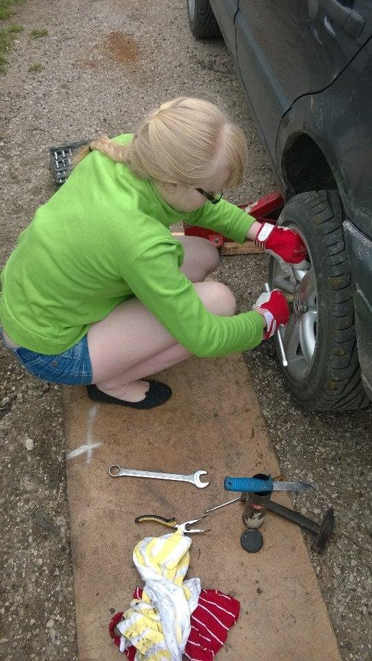

When Kasper invited me over to help with building stage decor and said that my task would be playing around with a jigsaw, I had pictured sitting on a clean floor, putting together nice puzzle pieces. You can only imagine my surprise when I was handed a humongous wooden board and an actual power tool. Plus, when we ended, the floor was far from clean.

<!--more-->

**I have not really had any proper experience with big boy tools**. At middle school, our class used to be split into two for handicraft lessons. The girls did knitting, sewing, and cooking while the boys got to play around with chunks of metal and wood and various tools. We did switch groups for one quartile, so that we would be able to widen our skillset, and I did make a beautiful jewellery box and a wind chime, but I have very little memory of the tools I used and the safety instructions I got.

Outside school, I have mostly been lacking a strong father figure. All the "big boy skills" I have come from the teachings of my grandfather or my significant others. The former taught me how to ride an old RS09 tractor (_no idea how to start it, though_), and how to switch the blades of a lawn mower. The latter taught me how to change car wheels (_AND how to drive_), how to connect the wiring of LED-lights, and attach the covers of electrical outlets.

<figure>

<figcaption>

_Changing a car wheel_

</figcaption>

</figure>

I also **take great pride** in the fact that I can fix some parts of my car, e.g. replacing the battery or various lights and lightbulbs. I remember when my car's reverse light was on strike (_again!_). I had to lift my car up in a random parking lot, climb under it with my head (_which was a bit dangerous since I did not know how well the jack would hold_), tear the socket out (_because boy, was it stuck! me and three men tried to pull it out and only the last one succeeded_), discover that the metal clip designed to bring power to the socket was so oxidised there was nothing left of it, solder a new metal lining for the socket (_instead of paying 60 euros for a replacement part_), and put it back in again. By now, I know the soul of my car lights like the back of my palm because similar things have happened to almost all of them.

In any case, I am diverging from what I originally set out to say, which is that **girls should be encouraged to know these things**, too. Yes, one can always call a handyman to do the repair work, but imagine the cost-savings and the powerful feeling of "I CAN!" when capable of doing these things yourself. Plus, when you live in a remote area, waiting for a handyman can take a while.

I come from a family of strong independent women who have never been afraid of doing what are traditionally considered to be **"man"-jobs**. My aunt takes down trees in the forest, plows the fields, and trims the grass using the grass edger. My mum puts together furniture and does plumbing like a magical bathroom wizard. I have great role models inspiring me to obtain these real life skills and admittedly, I have taken after them.

This is an excellent way to improve your **self-efficacy** - one's **belief** in being capable of successfully performing a task or handling a situation. For example, when building the stage decor, my first reaction was:

> "I cannot do this. I will not do this. I have never held power tools. I will mess something up or cut my fingers off."

The **learned helplessness** kicked in hard and it took some persuasion to get me to hold a jigsaw (_I almost dropped it, too, when I accidentally hit the power button and it turned on when I was not ready - where is the children's lock on these things?! Kasper: "These are not really children's tools…"_). However, I am a strong independent woman and I could not possibly show my weaknesses in public, so I just grasped the tool, put it against the wooden board, and pressed the button.

And I could do it. I could really do it. I was holding a powerful electric tool that could cut off my fingers in the blink of an eye, but instead I was cutting out enormous puzzle pieces from a wooden board. The same happened with a drill and a random-orbit sander. No cut-off fingers, no damaged floorboards, just perfectly sized and cut wooden boards, holes, and sanded corners. Boy, was I proud of being able to handle the big boy tools so well:

> "I **can** do this. I **can** handle big boy tools. I am going to build a house with my own bare hands!"

I had a positive experience that shifted my perspective, showed me that I am capable of performing a task, and, as a result, raised my self-efficacy in this field. If you want [more theory](http://www.uky.edu/~eushe2/BanduraPubs/Bandura1994EHB.pdf), I was supported by the processes of **enactive mastery** (_training, gaining relevant experience with the task_), **verbal persuasion** (_being assured orally that I have the necessary capabilities to handle the tools perform the task_), and **vicarious experience** (_observing a role model do the task_). If, however, I had encountered an uncontrollable bad event, a negative experience (e.g. cutting off my finger, messing up a board), I would have mostly felt as if I was lacking control, and would have been discouraged to pick up a tool next time, leading to… learned helplessness!

However, I had a positive experience and, as a result, next time I am presented with a power tool, most likely the thought going through my mind will not be "I cannot do this" but rather:

> "I have done this before and I have done this before successfully, so let's try it out and see what happens this time."

Now, I do not wish to say that women should take away men's jobs. By God, **if you have someone who can do these things for you, let them do it**! (_It is also a great ego boost for them._) But would you not rather know how to do these things when at some point you happen to be on your own? Plus, is it not really cool to be able to build something yourself?

I think it is and I think we should put more big boy tools in the hands of little girls. If not to **empower** them and **improve their skills**, then just so that they know how dangerous the tools can be and which **safety precautions** they should take, so that they do not climb up to a person working with a belt sander without a protective mask and glasses and end up with a lungful of sawdust (_which did not happen because Kasper made sure to put a muzzle on me to cover my airways before handing me a sander - I felt like a dog -.-_).

Now I feel really empowered, though. Give me a power tool and I will show you what I can do!
