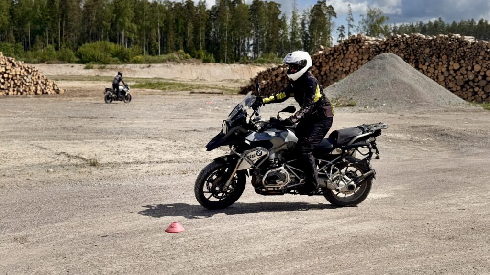
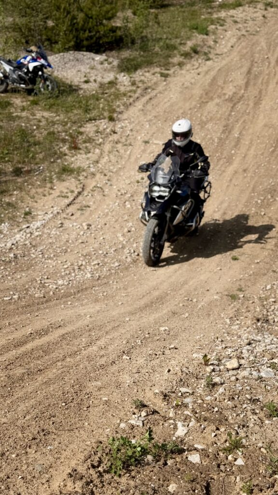
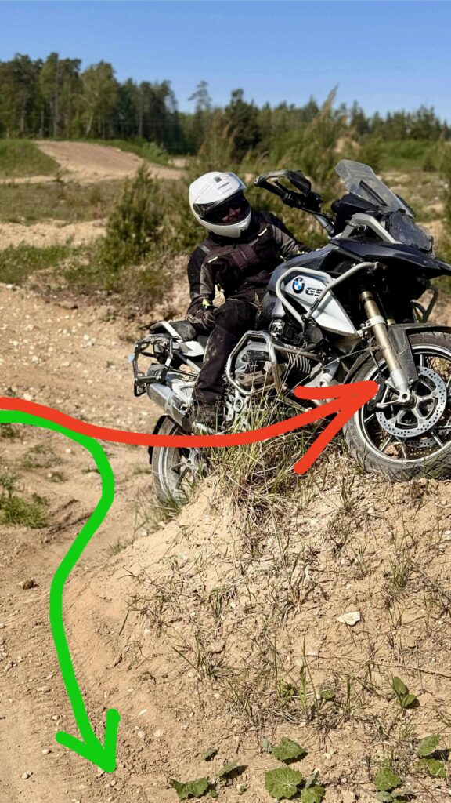
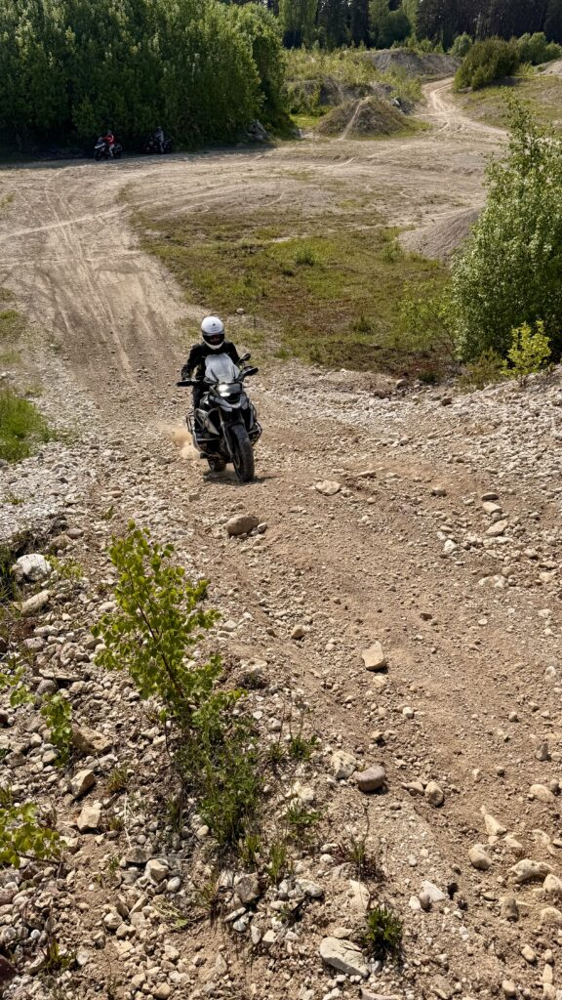
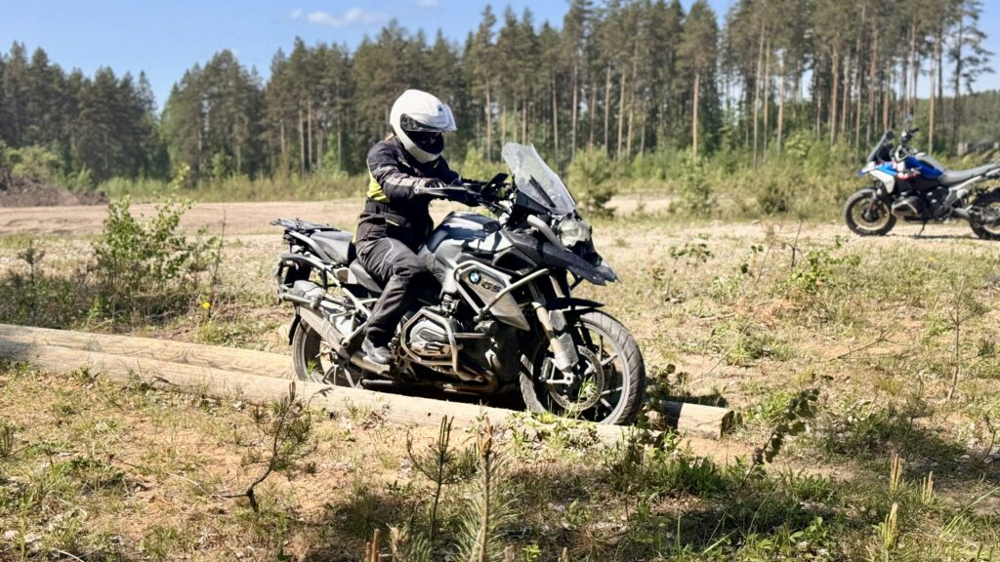

Käisin [Nordmoto](https://nordmoto.ee) korraldatud off-road mootorrattakoolitusel. No ja see ei olnud kohe üldse see, mis ma arvasin, et ta on!

<!--more-->

Kõigepealt administratiivne pool:

**Hind**: 170€ nägu (väga oma hinda väärt!) + lõunasöök ja vesi omal kulul  
**Kestus**: 10:00 - 17:00 koos lõunapausiga  
**Asukoht**: Kose-Risti karjäär  
**Grupi suurus**: 8 inimest  
**Rehvirõhk**: 1,5 bar ees ja taga

Kui mina loen kuskil "off-road koolitus _algajatele_", siis mina eeldan, et tegemist on koolitusega totaalsetele n00bidele. Inimestele, kes pole elu sees kruusa näinud, veel vähem mootorrattaga kruusateele roninud. Mina eeldasin, et kõigepealt me räägime, mis see kruus on. Paneme pedaalid ja heeblid paika. Analüüsime kehaasendeid ja proovime selle koha peal seistes paika saada. Harjutame oma ratta püsti saamist. Seisma jäämist, pidurdamist. Rattal seisvas asendis sõitmist. Siis võib-olla sõidame natuke korralikult kinni tambitud kruusateed, sirgelt ilmselgelt, eks ole. Seejärel võib-olla natuke suurema tükiga kruusal. Noh, et saaks tunnetuse, et kui ratas all vibab, siis polegi nii hirmus. Päeva lõpuks naerataks, lehvitaks ja ütleks: "Näeme järgmise astme koolitusel!"

Eeldamine on kõigi persekeeramiste ema.

[Nordmoto koolitus](https://nordmoto.ee/treeningud/) oli minu eeldustest sootuks erinev. Jah, me alustasime tõesti sellest, et juhendaja rääkis, kuidas on õige asend. Panime heeblid allapoole, et püsti seistes randmed keered poleks. Loeti sõnad peale, et maastikul sõites peab keha lõtv olema. "Kõik on rangelt vabatahtlik, ei pea kaasa tegema, kui ei soovi," kõlasid rahustavad sõnad koolitajalt, "aga muidu tehke lihtsalt minu järgi." Ja siis läksime soojendusharjutusi tegema.

Mina tundsin end kohe sõitma hakates puise ja ebakindlana. Ratas ju vibas all ja kui sellega harjunud pole, on psühholoogiliselt hirmus. Proovisin mingisugustki normaalset asendit kätte saada, sellal kui me soojenduseks kruusal tiirutasime, ja järsku vaatan - juhendaja laseb vasaku käe lenksust lahti, sirutab pikalt kõrvale välja. Mina samal ajal üritan meenutada, kuidas käib lihtlabane püsti seismine, kuigi olen seda viimased pea 30 aastat igapäevaselt harrastanud. Järgmisel ringil põlvitab koolitaja sadulal. "Mida vittu!" poetub ehe emotsioon kiivri sisse ja lähen veelgi enam krampi. Ülejärgmisel ringil astub juhendaja sõidu ajal üle ratta, seisab vastasjalaga jalaraual ja sirutab teise jala välja. Siis sama asi teisel poolel. Ise muudkui tiirutab rahulikult. Enamus osalejaid teevad ilusti järgi, vähemalt proovivad. Mina olen juba valmis ratta palguhunnikusse viskama ja koju kõmpima. Kui ma isegi soojendusharjutustega hakkama ei saa, mida ma ülejäänud kuus tundi teen??

No ja ega sealt edasi paremaks läinudki. Kui akrobaatikaringid tehtud, läksime sujuvalt hanereas maastikule. Mina jäin esialgu rivi lõppu, aga siis pagendas juhendaja peiksi minu taha - ilmselgelt ta teadis, mis juhtuma hakkab.

Ja pahhti! olimegi kitsal ebatasasel sinka-vonka liivasel teel puude vahel! Juurikad varbaid kõditamas ja kuuseoksad ninna turritamas. Esimesel meetril panin külje maha. Õnneks jäi ratas sisuliselt püsti, kuna liivakanal oli niivõrd kitsas. Sain ta lausa omal jõul üles tõstetud. Aga siis veel ja veel ja peegel murdus ja jäigi sinnasamma metsa maha ja kuidas kurat ma hakkama ei saa, oligi pisar silmis.

Ainuüksi algus tõmbas mind nii blokki ja lukku, et... Kujutage ette koolnukangestusega surnut, kellele on pulk perse pistetud ja ta seejärel tsikli otsa istutatud - see olin mina off-road koolitusel. "So the usual," ütleks peiks selle peale, ja tal oleks õigus. Mistõttu ma nendele koolitustele roningi.

Päev jätkus samas vaimus. Vahepeal natuke teooriat, siis harjutus, siis riburadapidi läbi karjääri. Kui joppas, sai korraks kohvri juurde, et kiirelt vett limpsida ja päiksekreemi näkku visata. Aga enamasti oli see "puhkepaus" mul ikkagi kuskil rattaga külili või kinni. Õnneks olid poisid nii armsad ja head, et ootasid kannatlikult mu pusimised ära ja aitasid ilusti püsti. Võib-olla kodus kirusid või õhtul irvitasid, aga mis minul sellest.

Paaril korral olin surmkindel, et ma lõpetan koos rattaga tiigis või puu otsas. Ühel korral sõitsin pea püstloodis suvalisest künkast üles, sest ei aju ega keha ega ükski rakk suutnud mõista, kuidas ma siit nüüd nii järsult paremale keerama peaksin. No ja siis ei keeranudki. Šahh! hoopis künka otsa kinni. "Sa pead lenksu ka keerama, et õiges suunas minna..." No kust mina tean, just oli jutt, et midagi tammun jalgadega ja vehin puusaga ja see paneb tsikli keerama. Sest kätega ju kramplikult lenksust kinni hoida ei tohi ja need peavad lõdvad olema. Millega ma siis keeran? Hammastega? Tutiga?? Mõtte jõul? Ma tõesti ei mõista... Ja polnud ka mahti mõistatada, muudkui uha edasi, krambis või mitte, mõistad või ei. Poisid jälle toestasid, kuni ma end künka otsast tagurpidi tagasi alla lasin. Vähemalt sellega sain hakkama. Aitäh, poisid. Taaskord.

Igaks juhuks täpsustan, et kui ütlen "poisid", siis tegelikult oli ikkagi tegu karvaste ja vähem karvaste meestega. Mõnel tundus maastikusõit käpas olevat. Mõni oli varem krossi sõitnud. Üks oli motokoolis sõiduõpetaja, kes tuli kaema, mida Nordmoto õpetab, kui asfalt otsa saab. Tasemeid oli erinevaid, kukkusid ja vastu pidasid kõik.

Mina olin selles koolitussatsis ainuke emane. Mitte, et see, mis sul jalge vahel on, maastikusõidule otseselt kaasa aitaks, kuid siiski. Veidi uhke tunne oli ka. Et üldse läksin. Et kõigest hoolimata terve päeva vastu pidasin. Et taltsutan nii suurt elajat, kui seda on BMW R1200 GS. Ja seda kõike asfaldirehvidega.

Mitte, et rehv oleks sellel koolitusel suurt rolli mänginud. Või siis ma lihtsalt ei oska igatseda, kuna pole kunagi maastikurehviga maastikul sõitnud. Igatahes kahel rattal olid siledamad rehvid ja hakkama saime mõlemad. Isegi sellest järsemast mäest ülesminekul, kus juhendaja ütles, et kui meie oma rehvidega sinna ronime, peame enne hoo üles võtma. Mida ma oma arust ka tegin. Peiks ütles pärast ikka, et venisin üles nagu tatt ja tal kukkus süda saapasäärde, kartes, et libisen sealt künkast ülepeakaela tagasi alla. Mina ei osanud midagi karta. Sealkohas olin ma vist kogu koolituse jooksul kõige vähem peas kinni.

Harjutused, mida koolitusel tegime, olid _(suvalises järjekorras, sest nii täpselt enam ei mäleta)_:

- Aeglane slaalom pööramise õppimiseks

- Tagasipööre (U-pööre)

- Mäest üles sõitmine

- Mäest alla sõitmine

- Äkkpidurdus mäel ja sidurit jõnksutades tagurpidi tagasi alla veeremine

- Erinevad pidurdamised mäest alla tulles (võimalikult aeglaselt alla)

- Kahe palgi vahel kitsas "kanalis" sõitmine

- (Äkk)pidurdamine tagapiduriga, esipiduriga

Ja kõige vahele sõit üles-alla sinka-vonka erinevaid radu mööda läbi karjääri.

Vaadake, mina ei ole lapsena krossi sõitnud. Motoriseeritud kaherattalist juhtisin esimest korda, kui olin 24-aastane. Ka jalgrattaga sõidan tagasihoidlikult, ei tõmba ketsi. Üleüldse võtan vähe riske ja olen pigem pussaja. No ja kruusateedega on mul oma teema alates sellest, kui kohe pärast juhiloa saamist võõra autoga paar mändi maha niitsin. Seega on kogu motomaailm, eriti off-road, minu jaoks tegelikult [suur eneseületus](https://evamaria.info/tvc-motohotelli-persoonilugu/) ja ma siiralt imestan ise ka, et ma selle koolituse täies mahus kaasa tegin. Veel viimase harjutuse ajal mõtlesin, et nüüd tuleb kindlasti veel üks lõpuring läbi karjääri ja mina seda kaasa ei tee - ei jaksa enam. Quit while you're ahead. Aga ei tulnudki. Järelikult tegin kogu koolituse kaasa. Jäin ellu ja terveks, välja arvatud sinikad säärtel ja ära murdunud peegel, mis on tänaseks juba uuega asendatud.

Aa ja ma olen vist ainuke inimene, kelle puhul ei pea paika kuldsed sõnad: "Tsikkel sõidab sinna, kuhu vaatad." Kes ei tea, siis pilgu ja pea pööramise tulemusel keerab ka keha ja mootorratas samas suunas. Seetõttu öeldakse, et näiteks tagasipöördel peaks öökulli kombel selja taha vaatama. Ma ise end kõrvalt ei näinud, aga tsiteerides peiksi: "Ilusti oli näha, kuidas sul on vaatega kõik õige - pea nii keere, kui vähegi võimalik, aga ometigi läheb ratas otse edasi, ei mingit mõju juhtimisele."

Kuigi koolitus oli intensiivne ja raske ja sugugi mitte see, milleks mina vaimselt valmistunud olin, oli see väga aega ja raha väärt. Hoolimata oma koolnukangestusest sain nii palju nippe ja rattatunnetust juurde. See kõik kandub üle ka asfaldile, muudab sõidu mõnusamaks ja ohutumaks. Eeldusel, et ma oma peast välja saan ja ülemõtlemise lõpetan... Tasapisi. Tasapisi.

Millistel motokoolitustel sina käinud oled? Mis motokoolitustele veel minna tasub? Keda soovitad külastada, keda vältida? Ma tean, et Nordmotol on ka edasijõudnute off-road koolitus, kuigi hoolimata korduvast küsimisest, me ei saanudki aru, mis seal rohkemat tehakse ja kuidas ma tean, kuna ma tolleks valmis olen. Seda ma tean, et veel ei ole. Aga peiks sai küll rohelise tule edasijõudnute koolitusele. Teada, mida järgmiseks sünnipäevaks kinkida.
