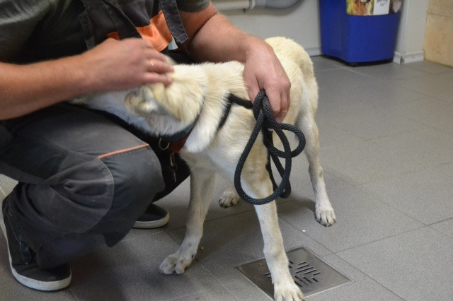
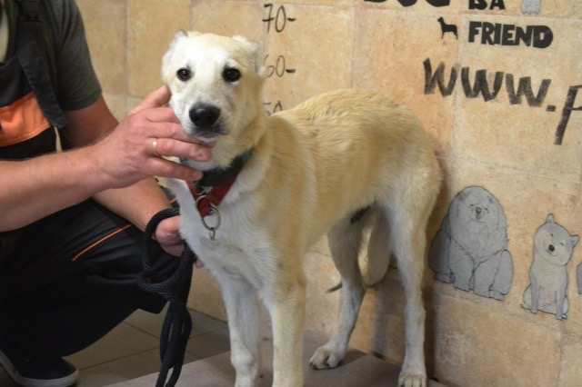
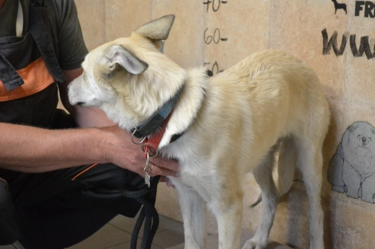
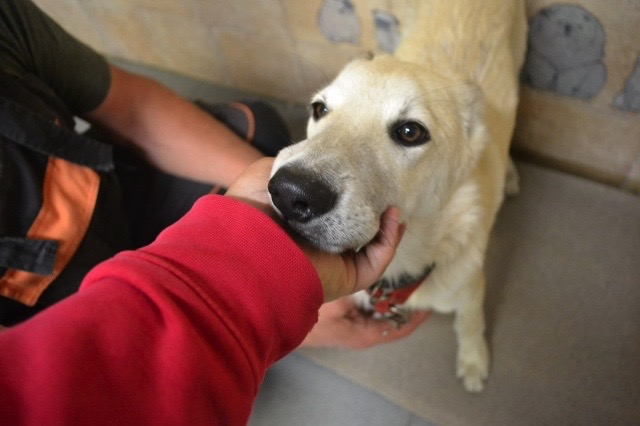
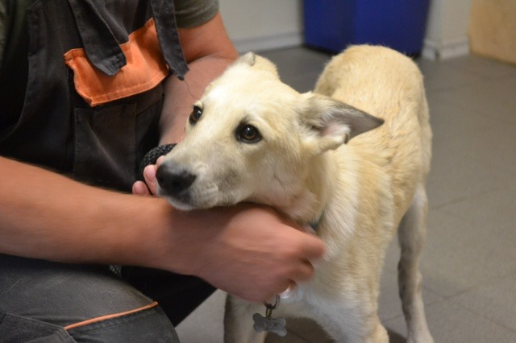
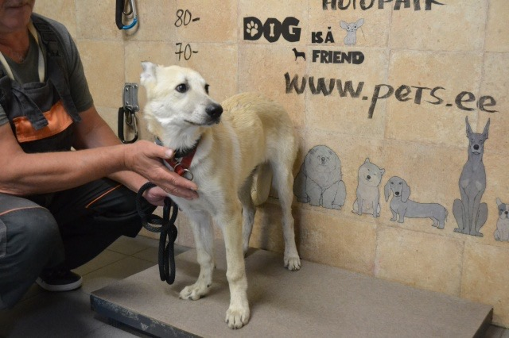
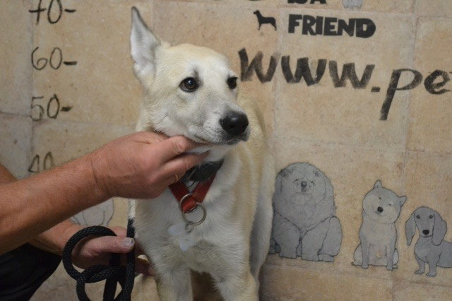
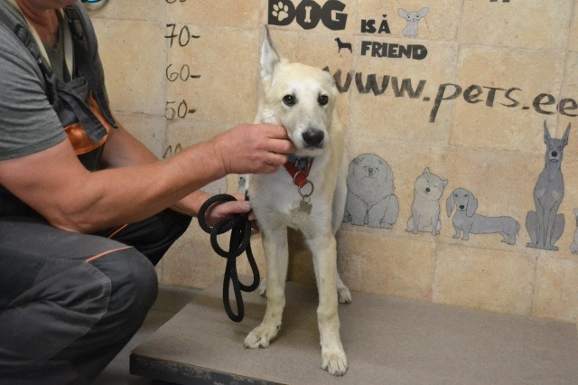
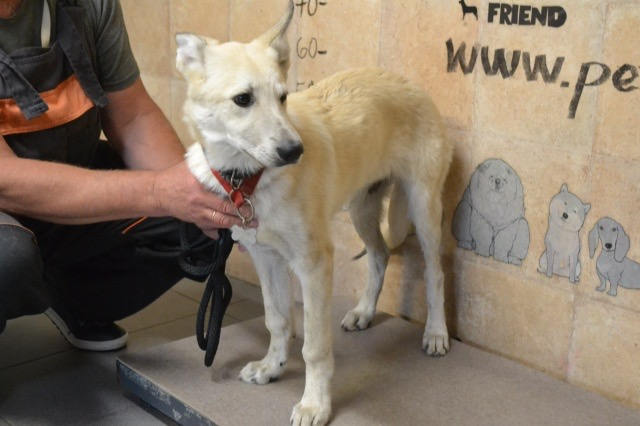

I saw you sitting in the corner today, panting, smiling, and looking at me. I read somewhere that dogs do not smile naturally. It's a skill only some of you adopt by observing us, humans. You seem to have picked it up, too. Little do you know what effect it has on people.

<!--more-->

I saw you sitting there, tired from our play session, belly full of kibble. I invited you on the couch with me. You came happily, hesitating a bit before putting your paws on the soft seat, trying to make sure if I had really meant it. I patted again and you jumped up and plotted yourself down next to me, looking up at me with your happy smile, still panting. And if I had by any chance had any worrisome thoughts before, at that moment they all disappeared. That, my dear, is the effect you have on people, be it with a smile or without.

Before you, I was afraid of dogs. I did some pretty stupid things as a child and was bitten by a dog or two. I always liked dogs, but I suppose over the years the fear settled in. But then you came. At first, I was afraid of you, too. Probably not as much as you were of me, but nevertheless. I feared you would bite me. I feared I would make a wrong move and anger you and you would sink your teeth in my hand. Or face. I feared being close to your mouth with my face. How silly it is to look back at it. If you had told me I would be kissing your cheeks, brushing your teeth, and pulling out turds from your throat with my bare hands two months ago, I would have laughed in your face! From a distance. Yet here we are, cohabiting peacefully, snuggling lovingly, playing vigorously.

I just wanted to say how much I admire how smart you are. I'm pretty sure you're smarter than me. You have this look in your eyes that says that even though you don't understand my words and sometimes struggle with figuring out the human world, you are full of intelligence. Your eyes sometimes look like they belong to an old man, full of wisdom. Yet, during our training sessions, they have this passionate twinkle, this playful glee in them. The kind that few old men manage to retain. The kind found in the eyes of a child when they are taken to the petting zoo for the first time. And that's what makes you special.

To be honest, I am starting to run out of tricks to teach you. You know the basics, such as sit, lie down, stay, come, leave it, bring, heel (we still need to work on that a lot), and some special ones, such as putting your paw in my hand when I greet you or barking on command. For most dogs that would already be enough. But you get a thrill out of learning new tricks. I love seeing you puzzled whenever I introduce something new. I can see the wheels turn in your head as you try to figure out what exactly gave you the treat. And you figure it out fast. Way faster than I learn how to teach you the trick.

Sometimes, I wonder if you are happy with us. Perhaps you could have been adopted by a nice family with a big yard instead of us with a small apartment? Maybe you could have been someone's second or third dog instead of being our first? Perchance there would have been someone who would have taken you to long hikes every other day?

You do not know to think of these other possibilities. And even if you do, you probably don't care. I bet by the 19th day at [that shelter](http://www.pets.ee/kodus/koerad/22263.htm#.X7Qq3C8RpQI) (and who knows where you were before?!) you had started to think that you were never getting out of there. And yeah, when we came and took you away from the people and the dogs you had already gotten used to, you were terrified. But, surely, after some weeks, you settled down and realised we weren't such bad people after all. It was warmer here, less crowded, you got nice treats, toys, pets, cuddles, more attention and playtime. Better than at the shelter most likely.

Yet I still can't help but wonder if you are truly satisfied that you ended up with us.

Tell me, Leo, are you happy?

<figure>

<figcaption>

_Leo at the shelter_

</figcaption>

</figure>
