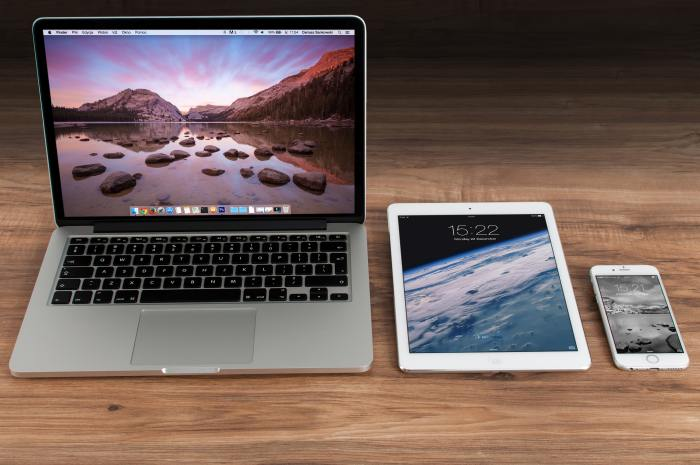
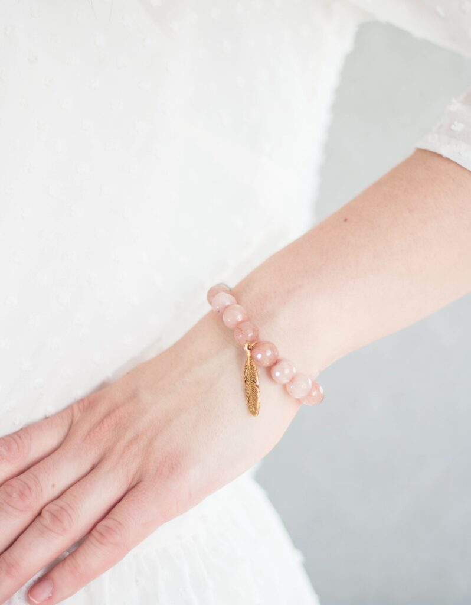

##### An understandable explanation

<figure>

<figcaption>

_Figure 1. Examples of screens._

</figcaption>

</figure>

Screens surround us everywhere. There is the TV screen, the computer monitor, the annoying moving advertisement that takes up the whole wall of the building right next to the bus stop, and the part that we poke daily on our smartphones.

But what is a **_tactile_** screen?

<!--more-->

Well, the “tactile” part of this term hints that the screen has something to do with _touch_. Is a touchscreen of a smartphone then a tactile screen? The answer is no, not really. While a **tactile screen** _does have_ a lot to do with touching, it is not you that taps the screen, but the screen that taps you!

Because us humans use our skin to feel touch, a tactile screen works best when it touches your body directly. When a tactile screen is against your body, it can sort of poke you like that annoying bench mate in elementary school.

<figure>

<figcaption>

_Figure 2. Tiles on a bathroom wall._

</figcaption>

</figure>

You can imagine a tactile screen to be the tiled wall of your bathroom. The wall is the screen and the tiles are what we call **_pixels_**– tiny parts that make up a screen when grouped together. But unlike your bathroom wall that hopefully stays put and does not wiggle around, the tiles on a tactile screen move. They can vibrate or even poke you gently. They can do this one by one or all at once!

As said before, a tactile screen works best when it is against your body. Since we usually do not want to stand against our bathroom wall the whole day, scientists have created tactile screens that are a bit smaller and more flexible, so that they can be carried with you, worn as a shirt or a wristband.

<figure>

<figcaption>

_Figure 3. A pearl bracelet._

</figcaption>

</figure>

In case of a tactile screen that looks like a wristband, for example, you can imagine a fancy pearl bracelet. Instead of the whole bathroom wall, we have taken only one row of tiles, turned them into tiny pearls, and wrapped that row of pearls around your wrist. Each pearl on the bracelet can still vibrate alone or they can group together with other pearls to tickle a larger area around your wrist. They can poke you softer or stronger and, in this way, give information about what is going on in the tactile screen.

So where do we **use** such tactile screens?

There are many possibilities. If it is a wristband, we can make it vibrate on the right side of your wrist when it is your mother calling, and on the left side when it is your father. We can use a tactile screen in shape of a shirt to feel the hug of a loved one from the other side of the world. A tactile screen can also copy the feel of different textures, such as silk or sandpaper. People who cannot see well or who are blind can use a tactile screen to feel with their fingertips what is written on the screen in Braille – a special writing system using dots that have been raised higher than the surrounding surface.

As you can see, there are many shapes, sizes and uses for tactile screens, but in short, you can think of a tactile screen as a surface that gives you information by tickling you gently.

* * *

#### **Author’s note:**

This article is based on the paper “Direct manipulation in tactile displays” by (Gupta, Pietrzak, Roussel, & Balakrishnan, 2016).

* * *

#### **References:**

Gupta, A., Pietrzak, T., Roussel, N., & Balakrishnan, R. (2016). Direct manipulation in tactile displays. _Conference on Human Factors in Computing Systems - Proceedings_, 3683–3693. https://doi.org/10.1145/2858036.2858161

Photo of the screens by [Pixabay](https://www.pexels.com/@pixabay) from [Pexels](https://www.pexels.com/photo/beaded-pink-bracelet-2346209/?utm_content=attributionCopyText&utm_medium=referral&utm_source=pexels)

Photo of the bathroom wall from the private collection of the author

Photo of the pearl bracelet by [Dominika Roseclay](https://www.pexels.com/@punchbrandstock?utm_content=attributionCopyText&utm_medium=referral&utm_source=pexels) from [Pexels](https://www.pexels.com/photo/beaded-pink-bracelet-2346209/?utm_content=attributionCopyText&utm_medium=referral&utm_source=pexels)
